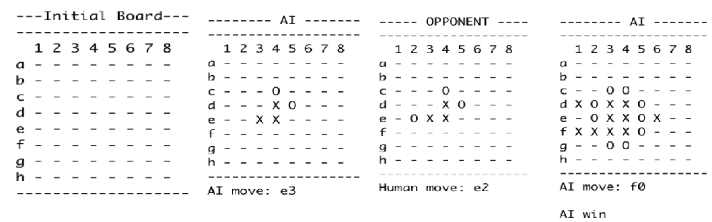
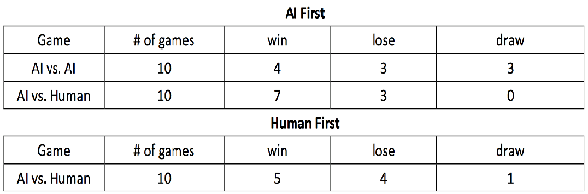

# Artificial Intelligence Game: 4-in-a-line
```
Algorithm: Minimax algorithm with alpha-beta pruning
```

```
File description:
  - main.java: Main function with several user inputs
  - Board.java: Board information
  - MiniMaxAgent.java: Minimax algorithm with alpha-beta pruning
  - Point_score.java: Evaluation function
  - pre_random_move.java: Random move function
```

## Approach

#### a. Start the program
- The program will ask the user for giving the time limit and the depth for the minimax algorithm with alpha-beta pruning.
- The user can decide who go first, Computer (AI) or Opponent (Human).

## Evaluation Function
The evaluation function consider all the cases include:

#### a. How many pieces in line
- Line of two: _ XX _, XX _, _XX, _X_X_, X_X_, _X_X, ...
- Line of three: _ XXX _, XXX _, _XXX, _X_XX_, XX_X_, _X_XX, ...
- Line of four: Winning case.

#### b. How many block ( red part )
- Block one:
- Meet the limit of the board: _XXX|
- Meet the opponent: _XXO
- Block two: O_XXX|, O_XXXO, OXX_X|, ...

#### c. Location of empty space ( yellow part )
- No empty space: XXX, _XXX, _XXX_, ...
- Empty space at position [1]: X_XX, _X_XXX, ...
- Empty space at position [2]: XX_X, _XX_XX, ...
- Empty space at position [3]: XXX_X, _XXX_X, ...

#### d. Decide the value
Decide the value for each cases depend on the situation list above. Keep changing the value for each cases to see which value works better in the games.


## Game Process (several steps example, not continual steps)



## Self Test



## License

This project is licensed under the MIT License - see the [LICENSE.md](LICENSE.md) file for details

## Acknowledgments

* Author: Hank Tsou
* Contact: hank630280888@gmail.com
* Project from California State Polytechnic University, Pomona, Computer Science, CS-4200 Artificial Intelligence
